&nbsp;&nbsp;&nbsp;

## Buoywatch
[Buoywatch](https://apps.apple.com/us/app/buoywatch-noaa-surf-buoys/id1479691525) is an iOS & Apple Watch app made using **SwiftUI** and **Combine** as I've been playing around with the latest Apple frameworks since day one after the WWDC.
It allows you to get real-time marine buoys data and get aware when the surf is good at a glance.
Too often swell arrives later than predicted, by checking the buoy data you can determine if the swell has arrived. If not, you can go back to bed =)

##### 🔨Technologies: SwiftUI, Combine, MVVM, Bitrise, Notifications, No third party libraries.
##### 🚀Platform: 📱iOS, ⌚️watchOS

<a href="https://apps.apple.com/us/app/buoywatch-noaa-surf-buoys/id1479691525" target="_blank">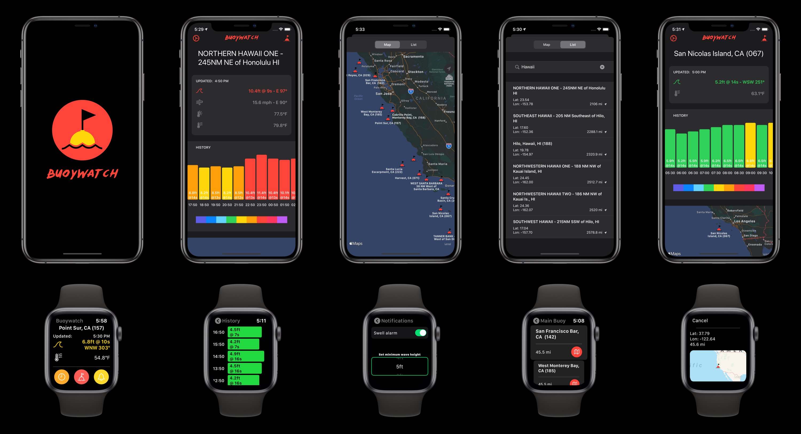</a>

## GlucoNightWatch
[GlucoNigthWatch](https://gluconightwatch.com/) is an app that provides customizable alarm and remote monitoring for GNSentry device users. People with diabetes and their relatives can benefit from the customizable alarm system provided by the app when used with GNSentry and Free Freestyle. The GNSentry bracelet sends a measure of the Freestyle every 5 minutes via Bluetooth to the app, then it triggers the alarms when necessary.

##### 🔨Technologies: Swift, Realm, Core Bluetooth, Charts, Push Notifications.
##### 🚀Platform: 📱iOS

<a href="https://gluconightwatch.com/" target="_blank">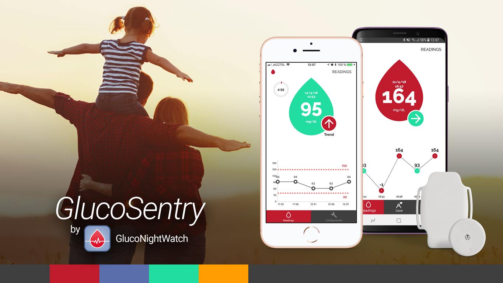</a>

## MyBestPhotobook
[MyBestPhotobook](https://apps.apple.com/us/app/photobook-app-mybestphotobook/id1402582617) allows you to crete and mail printed photo books easily in less than five minutes. Simply upload your photos to the app, edit and organize the layout however you like best. The most remarkable feature was an all-in-one photo picker which allows the user to import pictures from the device as well as from Instagram, Facebook, Dropbox, Google Photos and Google Drive. The picker was also implemented in [MyPostcard](#MyPostcard) app later on. Built on 2018/2019.

##### 🔨Technologies: Swift, Realm, PhotoEditor SDK, Clean Architecture.
##### 🚀Platform: 📱iOS

<a href="https://apps.apple.com/us/app/photobook-app-mybestphotobook/id1402582617" target="_blank">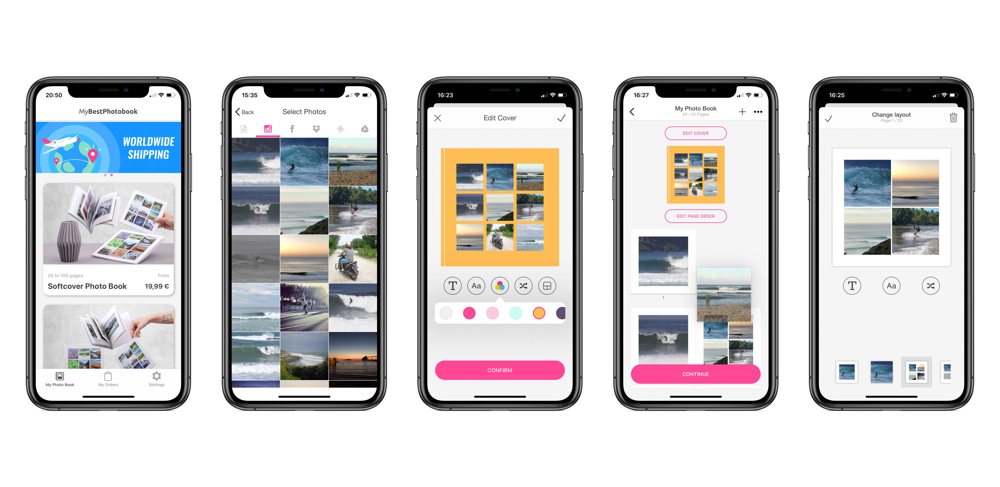</a>

## MyPostcard
[MyPostcard](https://apps.apple.com/us/app/mypostcard-postcard-app/id858686797) lets you create, personalise and send printed photo postcards and greeting cards worldwide from your iPhone or iPad. It has a total of more than 1 million downloads and 4,000 5-star ratings. I've mostly worked on updating the Objective-C codebase, bug fixes and adding new features. Worked on it during 2018/2019.

##### 🔨Technologies: Objective-C, Swift, PhotoEditor SDK.
##### 🚀Platform: 📱iOS, iPad.

## SUPERKORB
[SUPERKORB](https://web.archive.org/web/20190714151041/https://superkorb.com/) is a smart shopping platform for fast-moving consumer goods. The app compares your basket with all major vendors and finds the best-priced offer. Check-out and payment are conveniently handled within the app. It combines major online shops to offer over 100.000 articles. Worked on it in 2018.

##### 🔨Technologies: Swift, RxSwift, Clean Architecture.
##### 🚀Platform: 📱iOS

<a href="https://web.archive.org/web/20190714151041/https://superkorb.com/" target="_blank">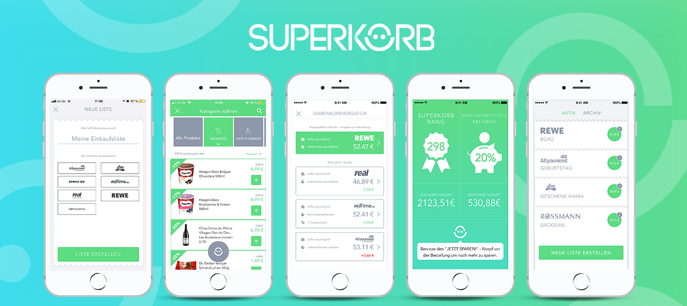</a>

## Bus Dich Weg
[Bus Dich Weg](https://apps.apple.com/ca/app/bus-dich-weg/id1315973814) lets users connect their devices to an internal wi-fi network available on tourist buses. As soon as the user is connected to the wi-fi system, he will be able to start listening to the tourist guide's speech. The major chanllenge was to research, test, compile and calibrate an audio library that supported **rtsp** for iOS and make it work with the less latency as possible. Also, we had to simulate the straming device with a **Raspberry-pi** as we didn't have access to the customer's bus device. It was built in 2017/2018.

##### 🔨Technologies: Swift, AVC Player, iBeacons, Push Notifications.
##### 🚀Platform: 📱iOS

<a href="https://apps.apple.com/ca/app/bus-dich-weg/id1315973814" target="_blank">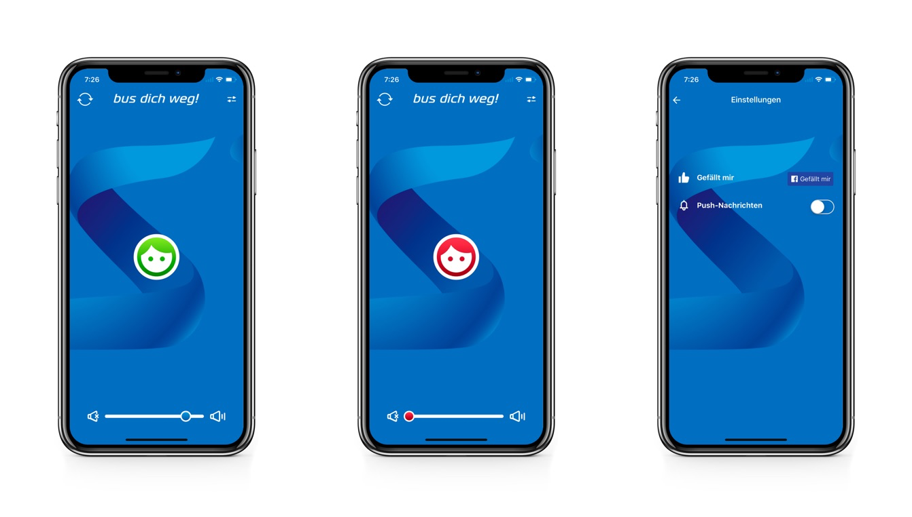</a>

## SPENN
[SPENN](https://apps.apple.com/us/app/spenn/id1189735564?ls=1) is a cryptocurrency wallet app which allows a user to conduct transactions such as money transfers and receive payments. It uses blockchain under the hood to secure transactions. It also brings the users the possibility to create a business and get paid directly to their phone. Really cool project, I've loved working on it. We were 2 iOS Developers. We've used Flow Coordinators pattern for the architecture of the app. Built in 2016.

##### 🔨Technologies: Swift, Flow Coordinators.
##### 🚀Platform: 📱iOS

<a href="https://apps.apple.com/us/app/spenn/id1189735564?ls=1" target="_blank">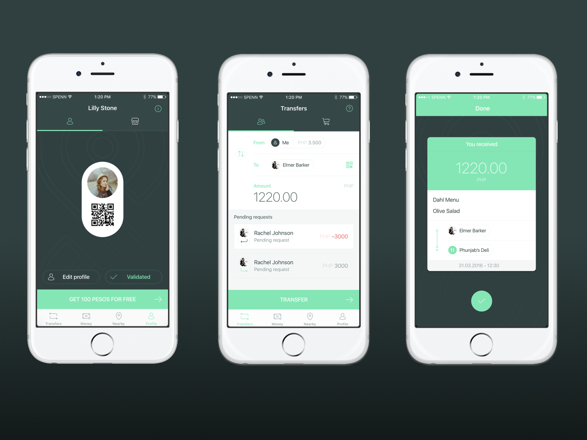</a>

## TravelKit - Mobile Traveller
[TravelKit](https://apps.apple.com/fr/app/travelkit-for-mobile-traveller/id1146520530) geolocates travellers and sends safety, security and travel-related alerts specific to their location. It aslo make calls to an emergency hotline from within the app. Built in 2016.

##### 🔨Technologies: Swift, Flow Coordinators, Push Notifications.
##### 🚀Platform: 📱iOS

<a href="https://apps.apple.com/fr/app/travelkit-for-mobile-traveller/id1146520530" target="_blank">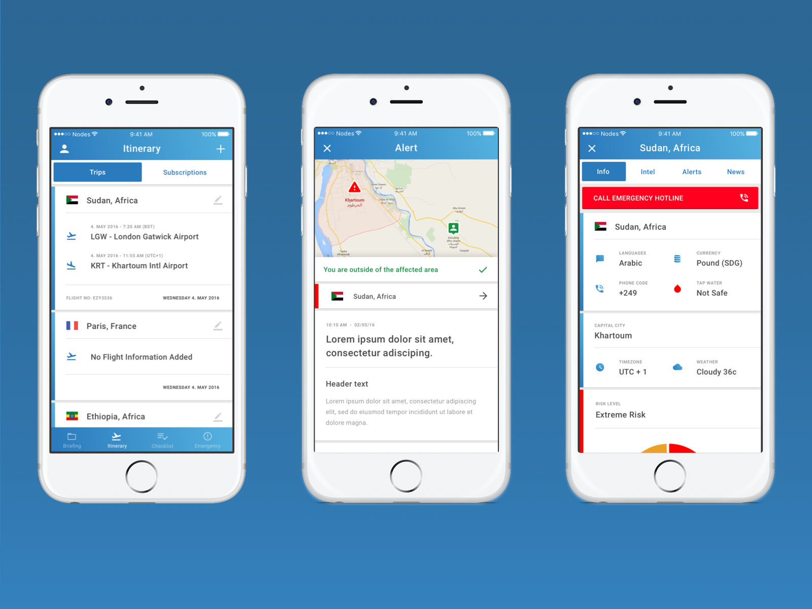</a>

## IATA - Economics
[IATA - Economics](https://apps.apple.com/us/app/iata-economics/id1111567152) brings access to industry-leading economic analysis on key aviation issues and market trends. In-depth research, reports, charts, presentations, videos and more. It allows the user to receive personalized notifications when new content is available. I've mostly worked on addapting the already built iPad app to the iOS version and on adding new features to both iOS and iPad versions. I worked on it in 2016.

##### 🔨Technologies: Swift, Push Notifications.
##### 🚀Platform: 📱iOS, iPad.

<a href="https://apps.apple.com/us/app/iata-economics/id1111567152" target="_blank">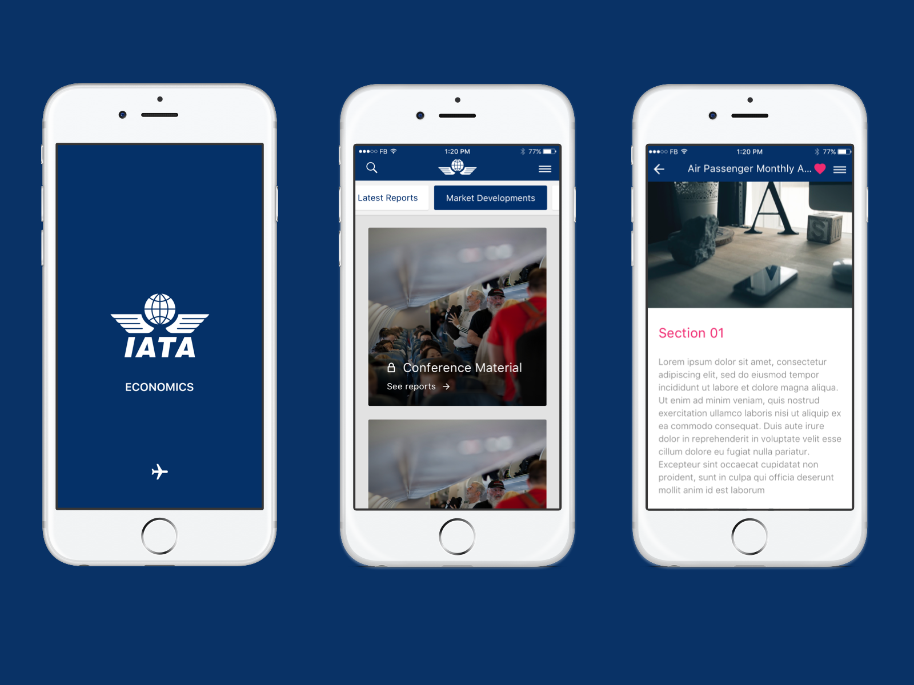</a>

## Swappy Books
[Swappy Books](https://apps.apple.com/us/app/swappy-books/id1198626384) lets you swap paper books with people nearby. It's a social network that uses **CloudKit ID** under the hood to keep track of user's published books without the need of requiring login/register process. 
It was developed in 2017. It uses [Swiping Carousel](https://github.com/PPacie/SwipingCarousel), an open source library developed by me, to present the available books.

##### 🔨Technologies: Swift, CloudKit, Push Notifications, Chat.
##### 🚀Platform: 📱iOS

<a href="https://apps.apple.com/us/app/swappy-books/id1198626384" target="_blank">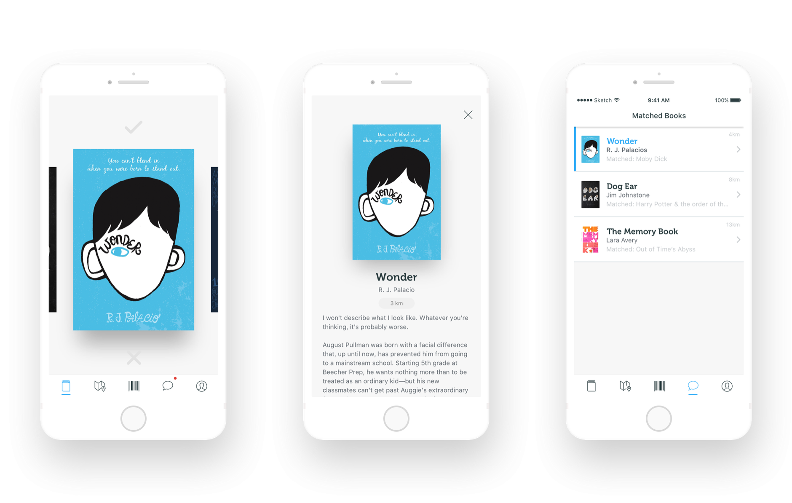</a>

## Tracing Board
[Tracing Board](https://apps.apple.com/us/app/tracing-board/id1040566627) converts your iPad into an on-the-go light box. This is a tool for those of us who draw daily and sometimes need to re-draw sketches until we are pleased with the results.
This was my first independent Swift app. It uses **Core Data** as persistency management. It was developed in 2015.

##### 🔨Technologies: Swift, Core Data, Core Image.
##### 🚀Platform: iPad

<a href="https://apps.apple.com/us/app/tracing-board/id1040566627" target="_blank">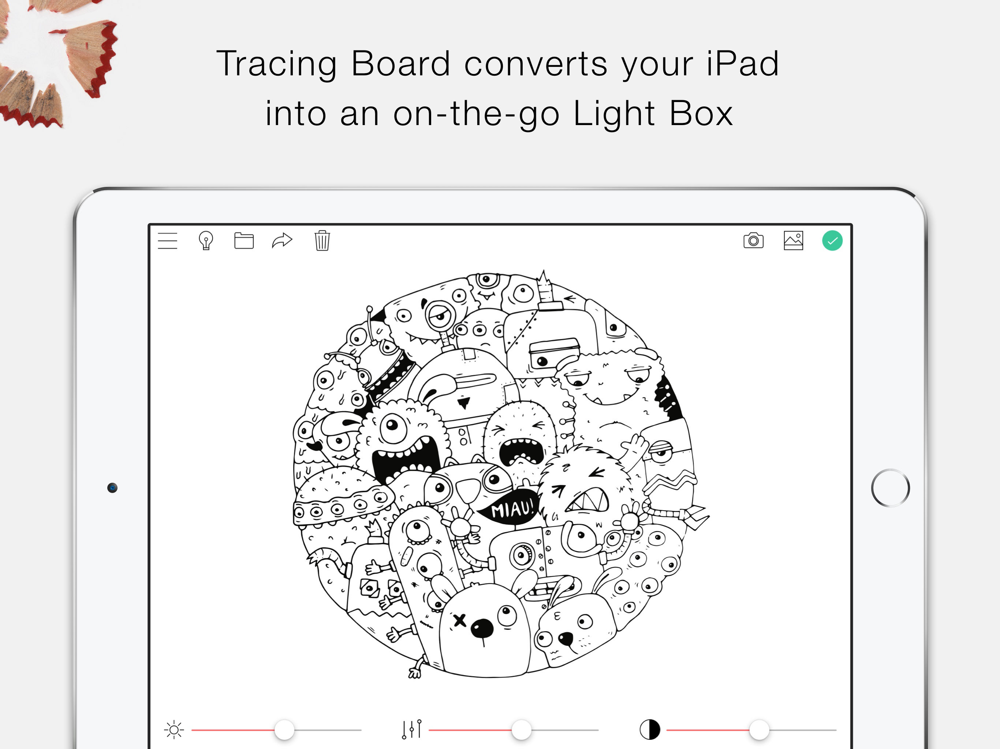</a>

## Surfate
It was a live streaming surf cams app. It got more than 230 surf spot webcams from al around the world. 
It was developed in 2014/2015. It allowed the user to get a realtime picture of a selected surf spot on the **Notifications Widget**. It got discontinued due to copyright issues with the API providers.

##### 🔨Technologies: Objective-C, WatchKit, App Extensions, AVPlayer.
##### 🚀Platform: 📱iOS, ⌚️watchOS, iPad

<a href="https://web.archive.org/web/20160304181919/http://surfate.com/" target="_blank">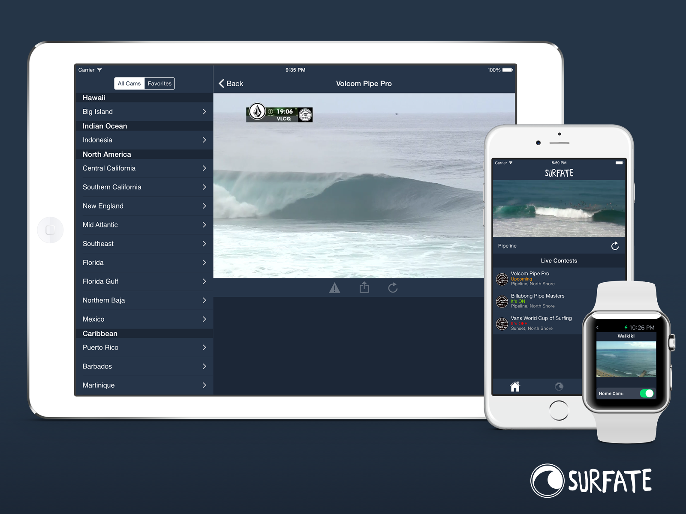</a>

## Big Mac Index
[Big Mac Index](https://apps.apple.com/us/app/big-mac-index-app/id908062605) was my first iOS app published on the AppStore. It intends to show whether currencies are at their *"correct"* value. This index was invented by The Economist in 1986. The main purpose of developing this app was to put in practice everything I've been learning on online courses, books, etc. It was developed in 2013/2014 using **Objective-C**.

##### 🚀Platform: 📱iOS

<a href="https://apps.apple.com/us/app/big-mac-index-app/id908062605" target="_blank">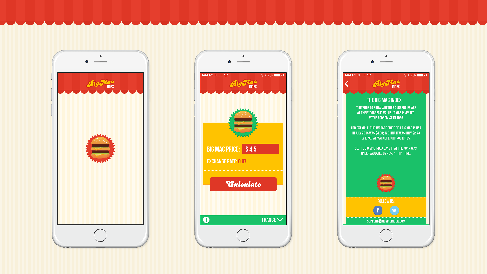</a>

*Do not hesitate to contact me if you would like to get a promo code to have a look at any of my indie apps.*
